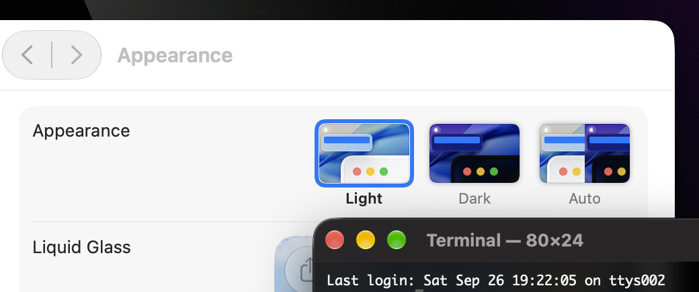

# macos-terminal-force-appearance



Add the "Dark Terminal" and "Light Terminal" apps to macOS. The title bars of these apps will remain dark or light, respectively, regardless of the system appearance.

## Installation:

> [!NOTE]
> Xcode Command Line Tools are required to build the shared library.
>
> ```sh
> xcode-select --install
> ```

```sh
# Install both "Dark Terminal" and "Light Terminal"
./install.sh
```

```sh
# Install "Light Terminal" only
./install.sh light
```

```sh
# Install "Dark Terminal" only
./install.sh dark
```

Apps will be installed to `~/Applications`.